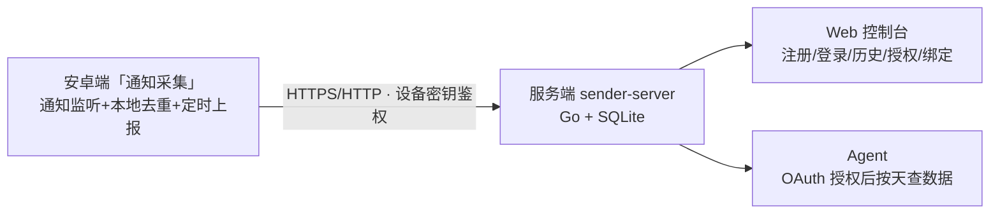

# Sender · 通知采集与数据中继

自托管的个人通知采集系统：安卓端持续采集微信、X 等 App 的通知消息（发送者 + 内容 + 时间），转发到自托管服务端存储；服务端提供 Web 控制台（浏览历史、账号与授权管理）和给 agent 用的 OAuth 授权 API。



## 目录结构

```
server/          服务端（Go + SQLite，含 Web UI 与 OAuth）
android/         安卓端（Kotlin + Compose，通知采集器「通知采集」）
dist/            构建产物：sender-server（Mac 二进制）、sender-server-linux-amd64、Sender-debug.apk
data/            服务端生产数据库（messages.db，备份 = 拷贝这个文件）
design/          Web UI 设计稿（三个方向初稿 + 已选定的 Terminal 方向）
tasks/           各阶段任务书（发给 agent 的 /goal 文档）
AGENTS.md        Agent 规则：下次会话的入口（定位/运行/约定/下一步）
```

## 快速开始

### 服务端（本机二进制）

```sh
./dist/sender-server            # 监听 :8080，数据存 data/messages.db
```

环境变量：`ADDR`（默认 `:8080`）、`DB_PATH`（默认 `data/messages.db`）、`TZ`（默认 `Asia/Shanghai`，消息按此归天）、`ALLOW_REGISTRATION`（默认 `true`；注册完自己的账号后设 `false`，关闭所有注册入口）。

### 服务端（Docker）

```sh
cd server && docker compose up -d --build
# 持久化在 named volume sender-data，healthcheck 走 /healthz
```

### 安卓端

构建：`cd android && ./gradlew assembleDebug`，产物在 `app/build/outputs/apk/debug/app-debug.apk`（或直接用 `dist/Sender-debug.apk`）。

安装后三步引导：开通知使用权 → 允许通知权限（Android 13+）→ 微信「我 → 设置 → 新消息通知 → 通知显示消息详情」打开。设置页填入服务端地址（真机填局域网 IP，如 `http://192.168.0.136:8080`，需与手机同一网络）。

## 使用流程

1. **部署服务端**（见上）。
2. **注册账号**：浏览器打开 `http://<服务器>:8080/register`，注册后设 `ALLOW_REGISTRATION=false`。
3. **绑定设备**：手机设置页查看「设备 ID / 设备密钥」，在网页「绑定设备」页粘贴绑定；或（阶段三）在 App 设置页直接点「登录并绑定账号」走 OAuth 一键绑定。未绑定设备上报会被拒（403）。
4. **浏览历史**：登录网页控制台，概览看统计（今日/本周/7 日趋势/App 占比），历史页按天/App/设备过滤、关键词搜索、分页浏览。
5. **给 agent 授权**：见下节。

## 给 agent 的接入说明

把服务器地址交给 agent 后，agent 用 OAuth **授权码 + PKCE** 流程自行完成授权（与 Google/Claude Code 一致），然后按天查数据：

1. agent 生成 PKCE 对（S256）和 `state`，拼出授权链接 `/authorize?response_type=code&client_id=…&redirect_uri=…&code_challenge=…&code_challenge_method=S256&state=…`。
2. 把链接给用户。用户点开、登录、在 sudo 式同意页点「批准 (y)」：
   - 有回调能力：浏览器 302 回 `redirect_uri?code=…&state=…`（loopback 回调如 `http://localhost:PORT/callback` 为标准做法）；
   - 无回调能力：用 `redirect_uri=urn:ietf:wg:oauth:2.0:oob`，用户把页面上的一次性 code 复制回贴给 agent。
3. agent 拿 `code + code_verifier + client_id + redirect_uri` 调 `POST /api/v1/oauth/token`（`grant_type=authorization_code`）换 `access_token`（7 天有效）。
4. 带 `Authorization: Bearer <token>` 调 `GET /api/v1/messages?day=YYYY-MM-DD` 或 `GET /api/v1/apps`。

token 只能看到**绑定到你账号的设备**的数据。完整示例见 `server/README.md`。

## API 概览（前缀 /api/v1）

| 端点 | 鉴权 | 说明 |
|---|---|---|
| `POST /devices/register` | `X-Device-Secret` | 设备注册，幂等 |
| `POST /devices/{id}/messages` | 设备 secret（Bearer） | 批量上报，≤500 条/批，`client_msg_id` 幂等去重；未绑定 403 |
| `POST /devices/bind` | 会话 cookie（阶段三起也认 Bearer token） | 设备绑定账号 |
| `GET /messages` | 用户 token（Bearer） | 按天查（`day`/`device_id`/`app`/`q` 全文搜索/`cursor`/`limit`），ts 升序，cursor 为 `ts:id` 复合键 |
| `GET /apps` | 用户 token（Bearer） | 按 App 聚合条数 |
| `GET /authorize` | OAuth | 授权码 + PKCE：登录门 → sudo 同意页 → 302 回调或 OOB 码页 |
| `POST /oauth/token` | OAuth | `grant_type=authorization_code`，换 access_token |

错误统一 `{"error":"…"}`；未知路径 404。完整文档见 `server/README.md`。

## 安全说明

- 数据敏感（微信等消息原文）。服务端明文 HTTP 仅供局域网；对外暴露务必置于 HTTPS 反向代理后（`X-Forwarded-Proto` 已支持）。
- 三层写侧防护：设备密钥鉴权 → 设备必须绑定账号才可上报 → `ALLOW_REGISTRATION=false` 关闭注册。
- 密码 bcrypt 存储；会话与 token 均存 SHA-256 哈希；OAuth 授权码强制 PKCE。
- 备份：复制 `data/messages.db` 即可。

## 阶段状态

| 阶段 | 内容 | 状态 |
|---|---|---|
| 一 | 核心闭环：安卓采集 → 服务端存储 → 查询 API | ✅ |
| 二 | 账号 + Web UI + OAuth + 设备绑定门槛 | ✅ |
| 三 | OAuth 授权码 + PKCE、历史页（过滤/搜索/统计）、Terminal 风 UI、App 一键绑定 | ✅ 已上线 |

设计定稿：`design/direction-approved.md` + `design/draft-2-terminal.html`。
